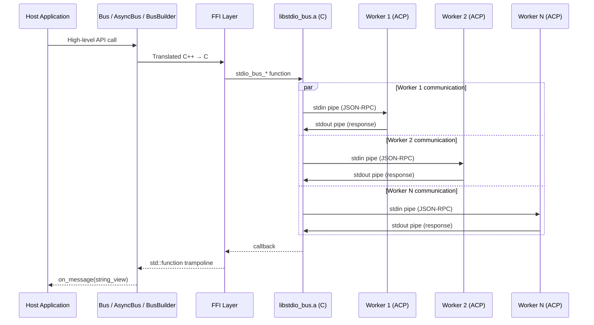
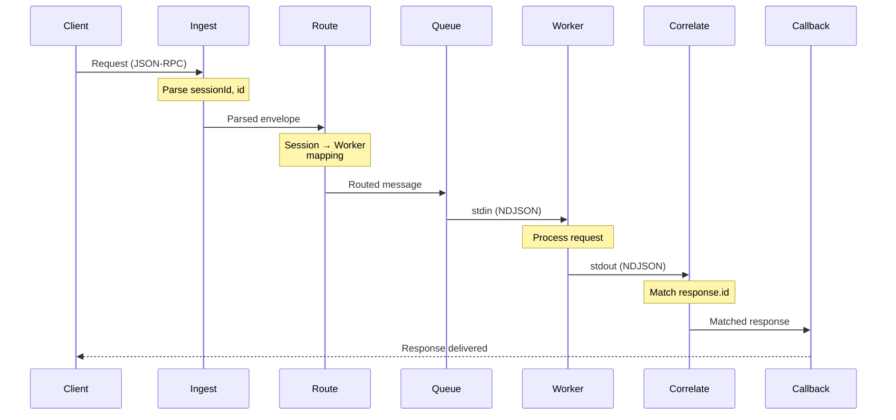

# What is stdio_bus?

## Purpose

stdio_bus is a **deterministic transport layer** for AI agent protocols (ACP/MCP). It provides:

- **Process supervision**: Manages worker process lifecycle (spawn, monitor, restart)
- **Message routing**: Routes JSON-RPC messages between clients and workers
- **Session management**: Maintains session affinity for stateful conversations
- **Backpressure control**: Prevents memory exhaustion under load

## What stdio Bus is NOT

- ✘ Not an AI/ML framework
- ✘ Not a message queue (no persistence)
- ✘ Not a protocol implementation (protocol-agnostic)
- ✘ Not multi-threaded (single event loop by design)

## Architecture

## Key Design Decisions

| Decision | Rationale |
|----------|-----------|
| Single-threaded | Deterministic behavior, no race conditions |
| Non-blocking I/O | Responsive event loop, no deadlocks |
| No external deps | Minimal attack surface, easy embedding |
| Protocol agnostic | Forward messages unchanged, parse only routing fields |
| NDJSON framing | Simple, debuggable, streaming-friendly |

## Message Flow

## When to Use stdio_bus

✓ **Good fit:**
- Local AI tool runtime (MCP servers)
- Agent orchestration with session state
- High-throughput message routing
- Cross-language worker pools
- Deterministic replay/audit requirements

✘ **Not ideal for:**
- Distributed multi-host deployments (use TCP mode with care)
- Persistent message queuing (use Kafka/RabbitMQ)
- Request/response with >10s latency (use async patterns)
