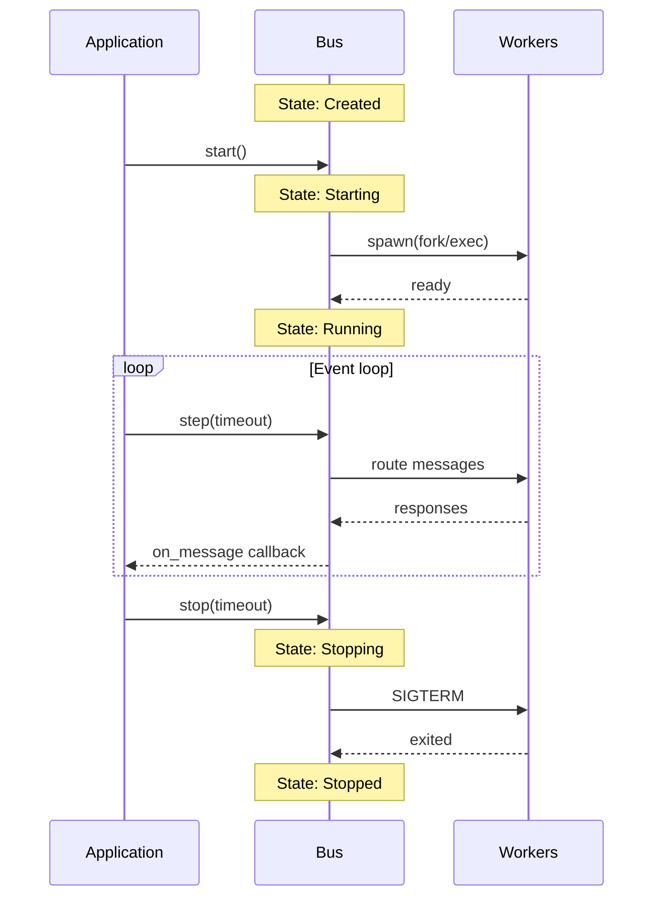

# Invariants and Guarantees

## Core Invariants

These guarantees are **fundamental and never violated**:

| Invariant | Description |
|-----------|-------------|
| **Deterministic routing** | Same sessionId always routes to same worker (until worker dies) |
| **Single-threaded** | All operations happen on one thread - no internal threading |
| **Non-blocking** | `step()` never blocks longer than specified timeout |
| **FIFO ordering** | Messages to same worker preserve order |
| **No message loss** | Messages are either delivered or error callback is invoked |

## Delivery Guarantees

| Scenario | Guarantee |
|----------|-----------|
| Worker alive | Message delivered, response returned via callback |
| Worker dies | Worker restarted, pending requests get error callback |
| Buffer full | `send()` returns `ErrorCode::Full` (retryable) |
| Invalid JSON | `send()` returns `ErrorCode::Invalid` |
| Session not found | New session created, assigned to least-loaded worker |

## Ordering Guarantees

### Within a Session
- Messages sent to same sessionId are delivered **in order**
- Responses may arrive out of order (depends on worker processing time)
- Correlation by request `id` is required for matching

### Across Sessions
- No ordering guarantee between different sessions
- Sessions may be processed in parallel by different workers

## Threading Model

```cpp
// CORRECT: Single thread usage
while (running) {
    bus.step(100ms);  // Process I/O
    // Do other work
}

// WRONG: Multi-threaded access
std::thread t1([&]{ bus.send(msg1); });  // ✘ Data race
std::thread t2([&]{ bus.step(100ms); }); // ✘ Data race
```

**Rule**: All Bus methods must be called from the same thread. Callbacks are invoked synchronously during `step()`.

## Backpressure Guarantees

| Condition | Behavior |
|-----------|----------|
| Input buffer full | `send()` returns `EAGAIN` or `Full` |
| Output queue full | Worker writes blocked until drained |
| Worker unresponsive | Timeout triggers error callback |

## Callback Guarantees

| Guarantee | Description |
|-----------|-------------|
| **Invocation context** | Always called from `step()` thread |
| **No reentrancy** | Callback must not call `step()` |
| **Exception safety** | Exceptions in callbacks are caught and logged |
| **Lifetime** | Callback objects must outlive Bus |

## State Machine Guarantees



| Transition | Guarantee |
|------------|-----------|
| Created → Starting | Workers begin spawning |
| Starting → Running | All workers ready, accepting messages |
| Running → Stopping | No new messages accepted, drain begins |
| Stopping → Stopped | All resources released, safe to destroy |

## Error Recovery Guarantees

| Error Type | Recovery |
|------------|----------|
| Retryable (Again, Full, Timeout) | Safe to retry immediately or with backoff |
| Configuration (Config, Invalid) | Fix config, recreate Bus |
| Runtime (Worker, Routing) | May recover automatically, check state |
| Fatal (State) | Cannot recover, must recreate Bus |

## What is NOT Guaranteed

- ✘ Response ordering across different requests
- ✘ Exactly-once delivery (at-least-once with idempotency keys)
- ✘ Persistence across restarts
- ✘ Thread safety for concurrent access
- ✘ Real-time latency bounds (best-effort)
