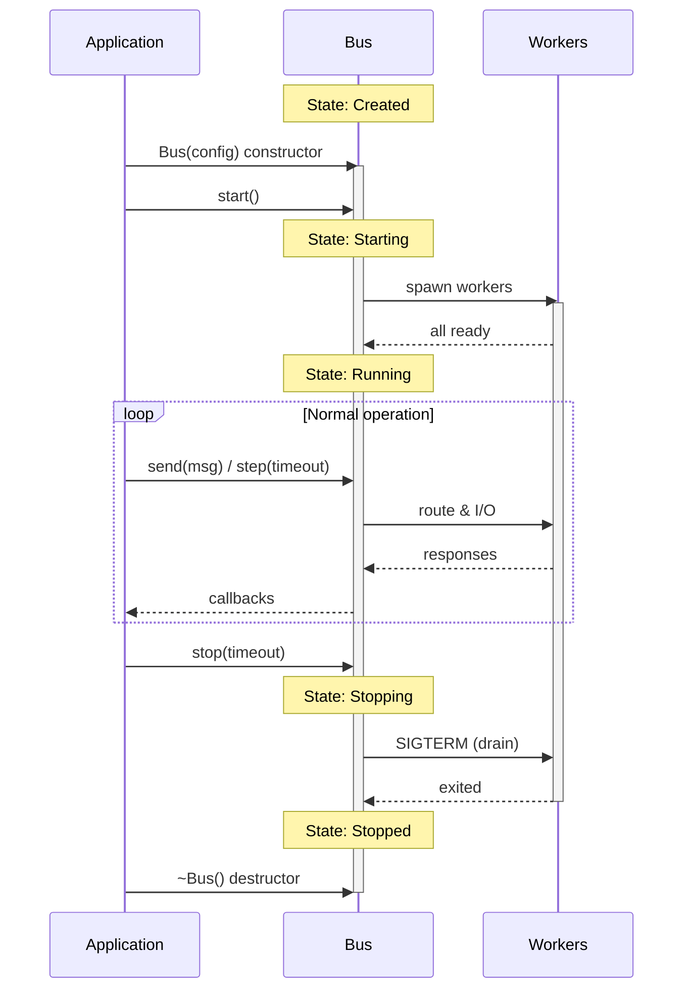

# Lifecycle State Machine

## Purpose

This document defines the Bus lifecycle, allowed state transitions, and API behavior in each state.

## State Model



## States

| State | Value | Description |
|-------|-------|-------------|
| Created | 0 | Bus constructed, not yet started |
| Starting | 1 | Workers being spawned |
| Running | 2 | Accepting and routing messages |
| Stopping | 3 | Graceful shutdown in progress |
| Stopped | 4 | All resources released |

## Transition Table

| From | Event/API | To | Notes |
|------|-----------|-----|-------|
| Created | `start()` success | Starting | Workers begin spawning |
| Created | `start()` failure | Created | Returns error, no state change |
| Starting | All workers ready | Running | Automatic transition |
| Starting | Worker spawn failure | Stopped | Cleanup and error |
| Running | `step()` | Running | Process I/O, stays running |
| Running | `send()` | Running | Queue message |
| Running | `stop()` | Stopping | Begin graceful shutdown |
| Running | Fatal error | Stopped | Emergency cleanup |
| Stopping | Drain complete | Stopped | All workers exited |
| Stopping | Timeout | Stopped | Force kill remaining workers |

## API Validity by State

| API | Created | Starting | Running | Stopping | Stopped |
|-----|---------|----------|---------|----------|---------|
| `start()` | ✓ | ✘ | ✘ | ✘ | ✘ |
| `step()` | ✘ | ✓ | ✓ | ✓ | ✘ |
| `send()` | ✘ | ✘ | ✓ | ✘ | ✘ |
| `stop()` | ✓ no-op | ✓ | ✓ | ✓ idempotent | ✓ no-op |
| `state()` | ✓ | ✓ | ✓ | ✓ | ✓ |
| `is_running()` | ✓ | ✓ | ✓ | ✓ | ✓ |
| `stats()` | ✓ | ✓ | ✓ | ✓ | ✓ |
| `worker_count()` | ✓ | ✓ | ✓ | ✓ | ✓ |

## Code Examples

### Happy Path

```cpp
stdiobus::Bus bus("config.json");
// State: Created

if (auto err = bus.start(); err) {
    // State: still Created (start failed)
    return 1;
}
// State: Starting → Running (automatic)

while (bus.is_running()) {
    bus.step(100ms);  // State: Running
    bus.send(message);
}

bus.stop(5s);
// State: Stopping → Stopped
```

### Safe Cleanup Pattern

```cpp
stdiobus::Bus bus("config.json");

try {
    bus.start();
    run_application(bus);
} catch (...) {
    bus.stop();  // Always safe to call
    throw;
}

bus.stop();  // Idempotent
```

### State Checking

```cpp
void process(stdiobus::Bus& bus) {
    switch (bus.state()) {
        case stdiobus::State::Created:
            std::cout << "Bus not started" << std::endl;
            break;
        case stdiobus::State::Running:
            bus.send(message);
            break;
        case stdiobus::State::Stopping:
            std::cout << "Shutting down, not accepting messages" << std::endl;
            break;
        case stdiobus::State::Stopped:
            std::cout << "Bus stopped" << std::endl;
            break;
    }
}
```

## Invariants

1. **Single lifecycle**: A Bus instance has one lifecycle. After Stopped, create a new instance.
2. **Idempotent stop**: `stop()` can be called multiple times safely.
3. **No restart**: Cannot call `start()` after `stop()`.
4. **Deterministic transitions**: State changes are deterministic based on API calls and events.

## Graceful Shutdown Contract

When `stop()` is called:

1. Stop accepting new messages (`send()` returns error)
2. Send SIGTERM to all workers
3. Wait for workers to exit (up to timeout)
4. If timeout: send SIGKILL
5. Close all connections
6. Release all resources
7. Transition to Stopped

```cpp
// Graceful shutdown with timeout
auto err = bus.stop(std::chrono::seconds(10));
if (err) {
    // Some workers didn't exit cleanly
    std::cerr << "Shutdown warning: " << err.message() << std::endl;
}
// State is Stopped regardless of error
```

## RAII Behavior

```cpp
{
    stdiobus::Bus bus("config.json");
    bus.start();
    // ... use bus ...
}  // Destructor calls stop() automatically

// Workers terminated, resources freed
```

## Thread Safety

- State transitions are **not thread-safe**
- All API calls must be from the same thread
- Callbacks are invoked from `step()` thread
