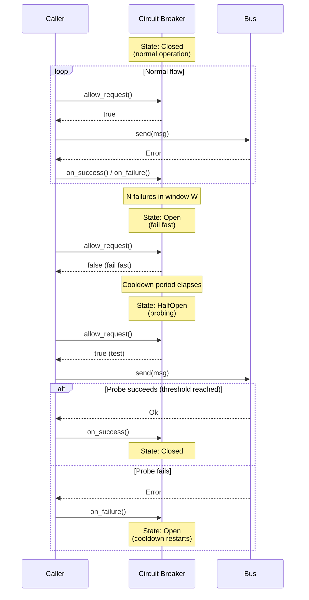

# Retry, Timeout, Circuit Breaker

Standard resilience patterns for robust stdio Bus integration.

## Timeout Policy

### Request Timeout

```cpp
// Using AsyncBus with timeout
auto future = asyncBus.request_async(
    R"({"jsonrpc":"2.0","method":"work","id":1})",
    std::chrono::seconds(30)  // 30s timeout
);

// Check with wait_for
if (future.wait_for(std::chrono::seconds(30)) == std::future_status::timeout) {
    // Request timed out
    handle_timeout();
}
```

### Manual Timeout Tracking

```cpp
struct PendingRequest {
    std::string id;
    std::chrono::steady_clock::time_point deadline;
    std::function<void(bool success, std::string response)> callback;
};

std::unordered_map<std::string, PendingRequest> pending;

void send_with_timeout(stdiobus::Bus& bus, const std::string& msg, 
                       std::chrono::milliseconds timeout,
                       std::function<void(bool, std::string)> cb) {
    std::string id = extract_id(msg);
    
    pending[id] = {
        id,
        std::chrono::steady_clock::now() + timeout,
        std::move(cb)
    };
    
    bus.send(msg);
}

void check_timeouts() {
    auto now = std::chrono::steady_clock::now();
    
    for (auto it = pending.begin(); it != pending.end(); ) {
        if (now >= it->second.deadline) {
            it->second.callback(false, "timeout");
            it = pending.erase(it);
        } else {
            ++it;
        }
    }
}
```

## Retry Policy

### Retry Only Retryable Errors

```cpp
bool is_retryable(stdiobus::ErrorCode code) {
    switch (code) {
        case stdiobus::ErrorCode::Again:
        case stdiobus::ErrorCode::Full:
        case stdiobus::ErrorCode::Timeout:
            return true;
        default:
            return false;
    }
}

// Or use built-in
if (err.is_retryable()) {
    // Safe to retry
}
```

### Exponential Backoff with Jitter

```cpp
#include <random>
#include <thread>

class RetryPolicy {
public:
    RetryPolicy(int max_attempts = 3,
                std::chrono::milliseconds base_delay = std::chrono::milliseconds(100),
                std::chrono::milliseconds max_delay = std::chrono::seconds(10))
        : max_attempts_(max_attempts)
        , base_delay_(base_delay)
        , max_delay_(max_delay)
        , rng_(std::random_device{}())
    {}
    
    template<typename Func>
    auto execute(Func&& func) -> decltype(func()) {
        for (int attempt = 1; attempt <= max_attempts_; ++attempt) {
            auto result = func();
            
            if (!result.error || !result.error.is_retryable()) {
                return result;
            }
            
            if (attempt < max_attempts_) {
                auto delay = calculate_delay(attempt);
                std::this_thread::sleep_for(delay);
            }
        }
        
        return func();  // Final attempt
    }
    
private:
    std::chrono::milliseconds calculate_delay(int attempt) {
        // Exponential backoff
        auto delay = base_delay_ * (1 << (attempt - 1));
        
        // Cap at max
        if (delay > max_delay_) delay = max_delay_;
        
        // Add jitter (0-100% of delay)
        std::uniform_int_distribution<> dist(0, delay.count());
        delay += std::chrono::milliseconds(dist(rng_));
        
        return delay;
    }
    
    int max_attempts_;
    std::chrono::milliseconds base_delay_;
    std::chrono::milliseconds max_delay_;
    std::mt19937 rng_;
};

// Usage
RetryPolicy retry(3, 100ms, 10s);

auto result = retry.execute([&]() {
    return bus.send(message);
});
```

## Circuit Breaker

### State Machine



### Implementation

```cpp
class CircuitBreaker {
public:
    enum class State { Closed, Open, HalfOpen };
    
    CircuitBreaker(int failure_threshold = 5,
                   std::chrono::seconds cooldown = std::chrono::seconds(30),
                   int success_threshold = 2)
        : failure_threshold_(failure_threshold)
        , cooldown_(cooldown)
        , success_threshold_(success_threshold)
        , state_(State::Closed)
        , failure_count_(0)
        , success_count_(0)
    {}
    
    bool allow_request() {
        std::lock_guard lock(mutex_);
        
        switch (state_) {
            case State::Closed:
                return true;
                
            case State::Open:
                if (std::chrono::steady_clock::now() >= open_until_) {
                    state_ = State::HalfOpen;
                    success_count_ = 0;
                    return true;
                }
                return false;
                
            case State::HalfOpen:
                return true;
        }
        return false;
    }
    
    void on_success() {
        std::lock_guard lock(mutex_);
        
        switch (state_) {
            case State::Closed:
                failure_count_ = 0;
                break;
                
            case State::HalfOpen:
                if (++success_count_ >= success_threshold_) {
                    state_ = State::Closed;
                    failure_count_ = 0;
                }
                break;
                
            case State::Open:
                break;
        }
    }
    
    void on_failure() {
        std::lock_guard lock(mutex_);
        
        switch (state_) {
            case State::Closed:
                if (++failure_count_ >= failure_threshold_) {
                    state_ = State::Open;
                    open_until_ = std::chrono::steady_clock::now() + cooldown_;
                }
                break;
                
            case State::HalfOpen:
                state_ = State::Open;
                open_until_ = std::chrono::steady_clock::now() + cooldown_;
                break;
                
            case State::Open:
                break;
        }
    }
    
    State state() const {
        std::lock_guard lock(mutex_);
        return state_;
    }
    
private:
    int failure_threshold_;
    std::chrono::seconds cooldown_;
    int success_threshold_;
    
    mutable std::mutex mutex_;
    State state_;
    int failure_count_;
    int success_count_;
    std::chrono::steady_clock::time_point open_until_;
};
```

### Usage with Bus

```cpp
CircuitBreaker breaker(5, 30s, 2);

stdiobus::Error send_with_breaker(stdiobus::Bus& bus, std::string_view msg) {
    if (!breaker.allow_request()) {
        return stdiobus::Error(stdiobus::ErrorCode::Again, "Circuit open");
    }
    
    auto err = bus.send(msg);
    
    if (err) {
        breaker.on_failure();
    } else {
        breaker.on_success();
    }
    
    return err;
}
```

## Combined Pattern

```cpp
class ResilientBus {
public:
    ResilientBus(stdiobus::Bus& bus)
        : bus_(bus)
        , retry_(3, 100ms, 10s)
        , breaker_(5, 30s, 2)
    {}
    
    stdiobus::Error send(std::string_view msg) {
        if (!breaker_.allow_request()) {
            return stdiobus::Error(stdiobus::ErrorCode::Again, "Circuit open");
        }
        
        auto result = retry_.execute([&]() {
            return bus_.send(msg);
        });
        
        if (result) {
            breaker_.on_failure();
        } else {
            breaker_.on_success();
        }
        
        return result;
    }
    
    CircuitBreaker::State circuit_state() const {
        return breaker_.state();
    }
    
private:
    stdiobus::Bus& bus_;
    RetryPolicy retry_;
    CircuitBreaker breaker_;
};
```

## Metrics to Expose

```cpp
struct ResilienceMetrics {
    std::atomic<uint64_t> request_count{0};
    std::atomic<uint64_t> success_count{0};
    std::atomic<uint64_t> failure_count{0};
    std::atomic<uint64_t> timeout_count{0};
    std::atomic<uint64_t> retry_count{0};
    std::atomic<uint64_t> circuit_open_count{0};
    
    void log() const {
        std::cout << "Requests: " << request_count
                  << " Success: " << success_count
                  << " Failures: " << failure_count
                  << " Timeouts: " << timeout_count
                  << " Retries: " << retry_count
                  << " Circuit opens: " << circuit_open_count
                  << std::endl;
    }
};
```

## Idempotency

For safe retries, ensure operations are idempotent:

```cpp
// Add idempotency key to requests
std::string make_idempotent_request(const std::string& method, 
                                     const std::string& params) {
    auto key = generate_uuid();
    
    return R"({"jsonrpc":"2.0","method":")" + method + 
           R"(","params":)" + params + 
           R"(,"id":")" + key + R"(","idempotencyKey":")" + key + R"("})";
}
```
