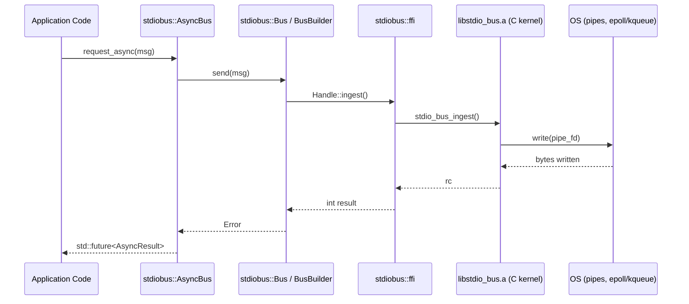
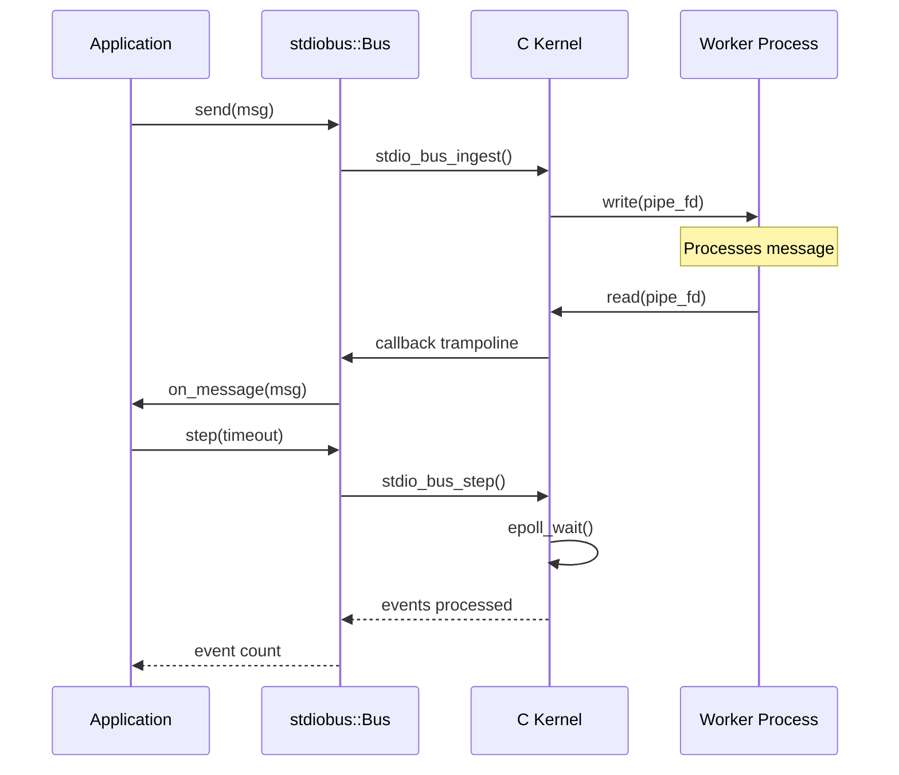
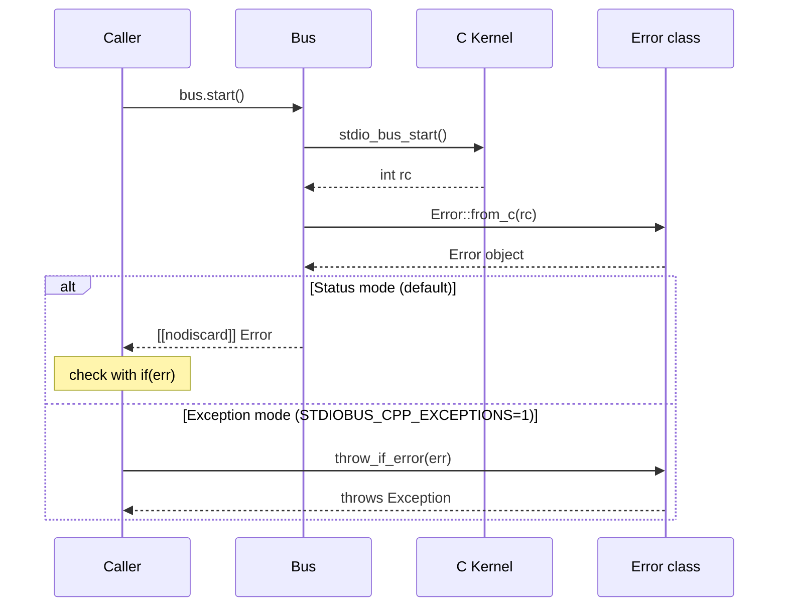

# Architecture

## Overview

The stdio Bus C++ SDK is a layered wrapper over a prebuilt C kernel library (`libstdio_bus.a`). It provides two API surfaces with different trade-offs:

## Components

### C Kernel (`libstdio_bus.a`)

- Written in C, compiled as a static library
- Manages worker process lifecycle (fork/exec, pipes, signals)
- Implements the event loop (epoll on Linux, kqueue on macOS)
- Handles message routing between host and workers
- Provides a stable C ABI (`stdio_bus_embed.h`)

### FFI Layer (`stdiobus::ffi`)

- 1:1 mapping over C API functions
- Non-owning `Handle` wrapper for `stdio_bus_t*`
- Type conversions (C enums → C++ enums, C structs → C++ structs)
- No resource management (caller owns lifecycle)

### Bus Facade (`stdiobus::Bus`)

- RAII: constructor creates, destructor destroys
- Callback trampolines: converts C function pointers to `std::function`
- Pimpl pattern: `Bus::Impl` hides C API details from public header
- Move-only semantics (non-copyable)
- `[[nodiscard]]` on error-returning methods

### AsyncBus (`stdiobus::AsyncBus`)

- Wraps `Bus` with request/response correlation
- Returns `std::future<AsyncResult>` for each request
- Simple JSON ID extraction for response matching
- Timeout management with `check_timeouts()`

### BusBuilder

- Fluent API for constructing `Bus` with options
- Validates configuration before creating the bus
- Returns a fully-configured `Bus` instance

## Data Flow

## Ownership Model

| Resource | Owner | Cleanup |
|----------|-------|---------|
| `stdio_bus_t*` handle | `Bus::Impl` | `~Bus()` calls `stdio_bus_destroy()` |
| Worker processes | C kernel | Terminated on `stop()` or `~Bus()` |
| Pipe file descriptors | C kernel | Closed on worker termination |
| Callback storage | `Bus::Impl::options` | Destroyed with `Impl` |
| Message buffers | C kernel | Valid only during callback |

## Error Flow

## Threading Model

- **Single-threaded by design**: One `Bus` instance per thread
- **No internal threads**: All I/O is driven by `step()` calls
- **Callback context**: Callbacks execute on the thread calling `step()`
- **AsyncBus mutex**: Protects the pending request map only

## Extension Points

| Extension | Mechanism |
|-----------|-----------|
| Custom logging | `on_log()` callback |
| Error monitoring | `on_error()` callback |
| Worker lifecycle | `on_worker()` callback |
| Event loop integration | `poll_fd()` for epoll/kqueue |
| Custom transport | TCP/Unix listener modes |

## Design Decisions

| Decision | Rationale |
|----------|-----------|
| Static library | Simpler deployment, no ABI concerns for shared lib |
| Pimpl pattern | Hides C API from public headers, stable ABI |
| No exceptions by default | Deterministic for embedded/system use cases |
| Inline namespace `v1` | Future ABI versioning without breaking existing code |
| Prebuilt kernel binaries | Users don't need to build the C kernel |
| `string_view` in callbacks | Zero-copy, no allocation in hot path |
