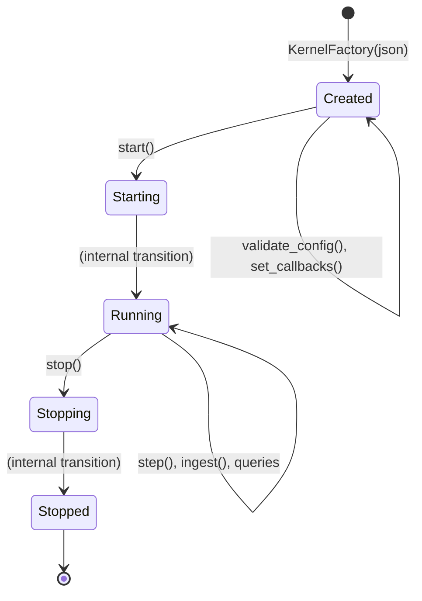
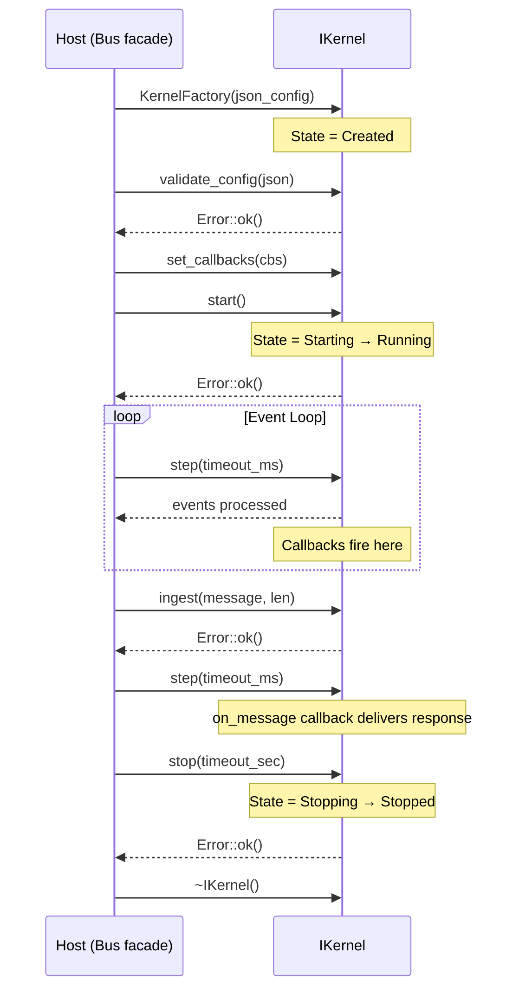

# IKernel Interface Contract Specification

This document defines the complete contract for the `IKernel` abstract interface. Any conformant implementation must satisfy the preconditions, postconditions, error conditions, lifecycle state machine, and threading rules described here.

**Header:** `<stdiobus/kernel.hpp>`  
**Namespace:** `stdiobus::v1` (accessed as `stdiobus::`)  
**Interface version:** `KERNEL_INTERFACE_VERSION = 1`

---

## Table of Contents

1. [Overview](#1-overview)
2. [Lifecycle State Machine](#2-lifecycle-state-machine)
3. [Valid Operations Per State](#3-valid-operations-per-state)
4. [Threading Contract](#4-threading-contract)
5. [Method Contracts](#5-method-contracts)
   - [Metadata](#51-metadata)
   - [Configuration Validation](#52-configuration-validation)
   - [Callbacks](#53-callbacks)
   - [Lifecycle](#54-lifecycle)
   - [Messaging](#55-messaging)
   - [State Queries](#56-state-queries)
   - [Embedded Workers](#57-embedded-workers)
6. [KernelCallbacks](#6-kernelcallbacks)
7. [KernelFactory](#7-kernelfactory)
8. [Interface Versioning](#8-interface-versioning)
9. [Error Model](#9-error-model)

---

## 1. Overview

`IKernel` is the abstract C++ interface that decouples the SDK facade (`Bus`, `AsyncBus`, `BusBuilder`) from any specific transport implementation. It defines 16 pure virtual methods across six categories:

| Category | Methods | Count |
|----------|---------|-------|
| Metadata | `interface_version()`, `name()` | 2 |
| Validation | `validate_config()` | 1 |
| Callbacks | `set_callbacks()` | 1 |
| Lifecycle | `start()`, `step()`, `stop()` | 3 |
| Messaging | `ingest()` | 1 |
| Queries | `state()`, `worker_count()`, `session_count()`, `pending_count()`, `client_count()`, `poll_fd()`, `stats()` | 7 |
| Embedded Workers | `register_embedded_worker()`, `unregister_embedded_worker()` | 2 |

Configuration crosses the SDK boundary exclusively as JSON (`std::string_view`). Each kernel implementation owns its config parsing and validation internally via `validate_config()`.

---

## 2. Lifecycle State Machine

Every `IKernel` implementation must follow this state machine. States are represented by the `stdiobus::State` enum.



### State Descriptions

| State | Value | Description |
|-------|-------|-------------|
| `Created` | 0 | Kernel constructed. Awaiting configuration validation, callback registration, and `start()`. |
| `Starting` | 1 | `start()` has been called. Internal initialization in progress (spawning workers, binding listeners). Transitions to `Running` internally. |
| `Running` | 2 | Kernel is operational. Messages can be ingested, I/O is pumped via `step()`. |
| `Stopping` | 3 | `stop()` has been called. Graceful shutdown in progress (draining queues, terminating workers). Transitions to `Stopped` internally. |
| `Stopped` | 4 | Kernel has shut down. No further operations are possible. Destructor is safe to call. |

### Transition Rules

- `Created → Starting`: Triggered by `start()`. Only valid from `Created`.
- `Starting → Running`: Internal transition. Completes when initialization finishes.
- `Running → Stopping`: Triggered by `stop()`. Only valid from `Running`.
- `Stopping → Stopped`: Internal transition. Completes when shutdown finishes.
- No backward transitions exist. Once stopped, a kernel cannot be restarted.

### Sequence Diagram: Typical Lifecycle



---

## 3. Valid Operations Per State

Operations called in an invalid state return `ErrorCode::State`. Query methods (`state()`, `worker_count()`, etc.) are always valid and never fail.

| State | Valid Operations | Invalid (returns `ErrorCode::State`) |
|-------|----------------|--------------------------------------|
| **Created** | `validate_config()`, `set_callbacks()`, `start()`, `state()`, all queries | `ingest()`, `stop()` |
| **Starting** | `state()`, all queries | `start()`, `ingest()`, `stop()` |
| **Running** | `step()`, `ingest()`, `stop()`, `state()`, all queries, `register_embedded_worker()`, `unregister_embedded_worker()` | `start()` |
| **Stopping** | `step()`, `state()`, all queries | `start()`, `ingest()`, `stop()` |
| **Stopped** | `state()`, all queries | `start()`, `ingest()`, `stop()` |

**Notes:**
- "All queries" refers to: `worker_count()`, `session_count()`, `pending_count()`, `client_count()`, `poll_fd()`, `stats()`.
- `step()` remains valid in `Stopping` to allow draining pending I/O during shutdown.
- `validate_config()` and `set_callbacks()` are only meaningful in `Created` state.

---

## 4. Threading Contract

The IKernel threading model is strictly single-threaded:

1. **Single-thread requirement:** All IKernel methods MUST be called from a single thread. There is no internal synchronization.
2. **Callbacks from `step()` only:** The kernel MUST invoke `KernelCallbacks` exclusively from within the `step()` call. Callbacks are synchronous — they execute on the caller's thread during `step()` and return before `step()` returns.
3. **No internal threads:** Kernel implementations MUST NOT spawn background threads. All I/O processing happens within `step()`.
4. **No mutex needed:** Because of the single-threaded contract, kernel implementations do not need internal mutexes or locks.
5. **Callback reentrancy:** Callbacks MUST NOT call back into the kernel (no reentrant calls to `ingest()`, `stop()`, etc. from within a callback).

```
┌─────────────────────────────────────────────────────┐
│                   User Thread                        │
│                                                     │
│  bus.start()  ──→  kernel_->start()                 │
│  bus.step()   ──→  kernel_->step()                  │
│                      │                              │
│                      ├── [process I/O]              │
│                      ├── callbacks.on_message(...)   │
│                      ├── callbacks.on_error(...)     │
│                      └── callbacks.on_log(...)       │
│                                                     │
│  bus.send()   ──→  kernel_->ingest()                │
│  bus.stop()   ──→  kernel_->stop()                  │
│                                                     │
└─────────────────────────────────────────────────────┘
```

**Exception:** `AsyncBus` adds its own mutex for its pending futures map, but the underlying `Bus::step()` → `kernel_->step()` call chain remains single-threaded.

---

## 5. Method Contracts

### 5.1 Metadata

#### `interface_version()`

```cpp
virtual int interface_version() const noexcept = 0;
```

| Aspect | Description |
|--------|-------------|
| **Purpose** | Report the IKernel interface version this implementation supports. |
| **Preconditions** | None. Callable in any state. |
| **Postconditions** | Returns an integer ≤ `KERNEL_INTERFACE_VERSION`. |
| **Error conditions** | None (noexcept). |
| **Return value** | Interface version number (currently `1`). |
| **Notes** | The facade rejects kernels reporting a version greater than `KERNEL_INTERFACE_VERSION`. |

#### `name()`

```cpp
virtual std::string_view name() const noexcept = 0;
```

| Aspect | Description |
|--------|-------------|
| **Purpose** | Return a human-readable identifier for this kernel implementation. |
| **Preconditions** | None. Callable in any state. |
| **Postconditions** | Returns a non-empty, null-terminated string view with static lifetime. |
| **Error conditions** | None (noexcept). |
| **Return value** | Implementation name (e.g., `"echo_kernel"`, `"stdio_bus_c_kernel"`). |
| **Notes** | The returned `string_view` must remain valid for the lifetime of the kernel. |

---

### 5.2 Configuration Validation

#### `validate_config()`

```cpp
[[nodiscard]] virtual Error validate_config(std::string_view json) const = 0;
```

| Aspect | Description |
|--------|-------------|
| **Purpose** | Validate that a JSON configuration string is acceptable for this kernel. The validator IS the type definition — it defines what constitutes valid input. |
| **Preconditions** | State is `Created`. The `json` parameter is a UTF-8 encoded string (may be empty). |
| **Postconditions** | If `Error::ok()` is returned, the kernel guarantees that `start()` will not fail due to configuration issues when given this same config. No state change occurs. |
| **Error conditions** | Returns `ErrorCode::Config` with a descriptive message if the JSON is malformed, missing required fields, or contains invalid values for this kernel. |
| **Return value** | `Error::ok()` on success, `Error(ErrorCode::Config, message)` on failure. |
| **Notes** | This method is `const` — it does not modify kernel state. Called by the facade before `start()`. Each kernel defines its own schema requirements. |

**Implementation guidance:**
- `EchoKernel`: Identity validation — accepts any input (including empty). Always returns `Error::ok()`.
- `CKernel`: Verifies required fields (e.g., `"workers"` array) are present and well-formed.
- Custom kernels: Define and enforce your own schema.

---

### 5.3 Callbacks

#### `set_callbacks()`

```cpp
virtual void set_callbacks(const KernelCallbacks& callbacks) = 0;
```

| Aspect | Description |
|--------|-------------|
| **Purpose** | Register callback functions for kernel → host event delivery. |
| **Preconditions** | State is `Created`. Must be called before `start()`. |
| **Postconditions** | The kernel stores the callbacks and will invoke them during subsequent `step()` calls. |
| **Error conditions** | None (void return). Behavior is undefined if called after `start()`. |
| **Notes** | Individual callback fields in `KernelCallbacks` may be empty (`nullptr` function). The kernel must check before invoking. Callbacks are not copied — the kernel stores a copy of the struct (which contains `std::function` objects that manage their own memory). |

---

### 5.4 Lifecycle

#### `start()`

```cpp
[[nodiscard]] virtual Error start() = 0;
```

| Aspect | Description |
|--------|-------------|
| **Purpose** | Initialize the kernel: spawn workers, bind listeners, prepare for I/O. |
| **Preconditions** | State is `Created`. `set_callbacks()` has been called. `validate_config()` has returned `Error::ok()` (enforced by facade). |
| **Postconditions** | On success: state transitions to `Starting` then `Running`. Workers are spawned, listeners are bound. On failure: state remains `Created`. |
| **Error conditions** | `ErrorCode::State` if not in `Created` state. Other error codes for implementation-specific failures (e.g., `ErrorCode::Worker` if worker spawn fails, `ErrorCode::Config` if runtime config issue). |
| **Return value** | `Error::ok()` on success, error otherwise. |
| **Notes** | The `Starting → Running` transition may be instantaneous (EchoKernel) or involve async initialization (CKernel). After `start()` returns successfully, the kernel is in `Running` state. |

#### `step()`

```cpp
virtual int step(int timeout_ms) = 0;
```

| Aspect | Description |
|--------|-------------|
| **Purpose** | Pump the I/O event loop. Process pending messages, deliver callbacks. |
| **Preconditions** | State is `Running` or `Stopping`. |
| **Postconditions** | Pending I/O is processed. Callbacks (`on_message`, `on_error`, `on_log`, `on_worker`, `on_client_connect`, `on_client_disconnect`) may fire synchronously during this call. |
| **Error conditions** | Returns a negative error code (cast from `ErrorCode`) on fatal failure. |
| **Parameters** | `timeout_ms`: `0` = non-blocking (return immediately), `> 0` = wait up to N milliseconds, `-1` = block until an event occurs. |
| **Return value** | Number of events processed (≥ 0) on success, or negative error code on failure. |
| **Notes** | This is the only method from which callbacks are invoked. Must be called in a loop for continuous operation. In `Stopping` state, `step()` drains remaining I/O. |

#### `stop()`

```cpp
[[nodiscard]] virtual Error stop(int timeout_sec) = 0;
```

| Aspect | Description |
|--------|-------------|
| **Purpose** | Initiate graceful shutdown. Terminate workers, close listeners, drain queues. |
| **Preconditions** | State is `Running`. |
| **Postconditions** | On success: state transitions to `Stopping` then `Stopped`. All workers are terminated, listeners closed, pending messages cleared. On failure: state may be `Stopping` (partial shutdown). |
| **Error conditions** | `ErrorCode::State` if not in `Running` state. `ErrorCode::Timeout` if workers do not exit within `timeout_sec`. |
| **Parameters** | `timeout_sec`: Maximum seconds to wait for workers to exit gracefully. |
| **Return value** | `Error::ok()` on success, error otherwise. |
| **Notes** | After `stop()` returns, the kernel is in `Stopped` state. The destructor is safe to call. A stopped kernel cannot be restarted. |

---

### 5.5 Messaging

#### `ingest()`

```cpp
[[nodiscard]] virtual Error ingest(const char* message, size_t len) = 0;
```

| Aspect | Description |
|--------|-------------|
| **Purpose** | Send a message from the host into the bus for routing to workers. |
| **Preconditions** | State is `Running`. `message` is a valid pointer to `len` bytes. |
| **Postconditions** | The message is queued for delivery. It will be routed to the appropriate worker during a subsequent `step()` call. |
| **Error conditions** | `ErrorCode::State` if not in `Running` state. `ErrorCode::Invalid` if `message` is `nullptr` or `len` is 0. `ErrorCode::Full` if internal buffers are full (retryable). `ErrorCode::Routing` if no worker can handle the message. |
| **Parameters** | `message`: Pointer to message bytes (typically JSON-RPC). `len`: Length in bytes. |
| **Return value** | `Error::ok()` on success, error otherwise. |
| **Notes** | The kernel copies the message data internally. The caller may free or reuse the buffer after `ingest()` returns. Messages are typically JSON-RPC formatted (MCP/ACP protocols). |

---

### 5.6 State Queries

All query methods are `const noexcept` and callable in any state. They never fail.

#### `state()`

```cpp
virtual State state() const noexcept = 0;
```

| Aspect | Description |
|--------|-------------|
| **Purpose** | Return the current lifecycle state. |
| **Return value** | One of: `State::Created`, `State::Starting`, `State::Running`, `State::Stopping`, `State::Stopped`. |

#### `worker_count()`

```cpp
virtual int worker_count() const noexcept = 0;
```

| Aspect | Description |
|--------|-------------|
| **Purpose** | Return the number of currently active worker processes. |
| **Return value** | Non-negative integer. Returns 0 if no workers are active or if the kernel does not support workers (e.g., EchoKernel). |

#### `session_count()`

```cpp
virtual int session_count() const noexcept = 0;
```

| Aspect | Description |
|--------|-------------|
| **Purpose** | Return the number of active sessions (request/response pairs in flight). |
| **Return value** | Non-negative integer. |

#### `pending_count()`

```cpp
virtual int pending_count() const noexcept = 0;
```

| Aspect | Description |
|--------|-------------|
| **Purpose** | Return the number of messages queued but not yet delivered. |
| **Return value** | Non-negative integer. For EchoKernel, this is the number of ingested messages awaiting the next `step()`. |

#### `client_count()`

```cpp
virtual int client_count() const noexcept = 0;
```

| Aspect | Description |
|--------|-------------|
| **Purpose** | Return the number of connected external clients (TCP/Unix socket modes). |
| **Return value** | Non-negative integer. Returns 0 in embedded mode or for kernels that don't support listeners. |

#### `poll_fd()`

```cpp
virtual int poll_fd() const noexcept = 0;
```

| Aspect | Description |
|--------|-------------|
| **Purpose** | Return a file descriptor suitable for `poll()`/`epoll()`/`kqueue()` integration. |
| **Return value** | A valid file descriptor (≥ 0) that becomes readable when the kernel has events to process, or `-1` if poll-based integration is not available. |
| **Notes** | When the returned fd is readable, the host should call `step()`. EchoKernel returns `-1` (no poll fd available). |

#### `stats()`

```cpp
virtual Stats stats() const noexcept = 0;
```

| Aspect | Description |
|--------|-------------|
| **Purpose** | Return a snapshot of cumulative statistics. |
| **Return value** | A `Stats` struct with fields: `messages_in`, `messages_out`, `bytes_in`, `bytes_out`, `worker_restarts`, `routing_errors`, `client_connects`, `client_disconnects`. |
| **Notes** | Counters are cumulative from kernel construction. They are never reset. |

---

### 5.7 Embedded Workers

#### `register_embedded_worker()`

```cpp
virtual int register_embedded_worker(int fd_to_worker,
                                     int fd_from_worker,
                                     std::string_view pool_id) = 0;
```

| Aspect | Description |
|--------|-------------|
| **Purpose** | Register an in-process embedded worker using pre-existing file descriptors (e.g., from `socketpair()`). |
| **Preconditions** | State is `Running`. `fd_to_worker` and `fd_from_worker` are valid open file descriptors. `pool_id` identifies the worker pool. |
| **Postconditions** | On success: the kernel takes ownership of the fds and adds them to its event loop. The worker participates in message routing. |
| **Error conditions** | Returns a negative error code if: state is not `Running` (maps to `ErrorCode::State`), fds are invalid (`ErrorCode::Invalid`), or the kernel does not support embedded workers (`ErrorCode::Invalid`). |
| **Parameters** | `fd_to_worker`: FD the kernel writes to. `fd_from_worker`: FD the kernel reads from. `pool_id`: Pool identifier string. |
| **Return value** | Worker ID (≥ 0) on success, or negative error code on failure. |
| **Notes** | EchoKernel returns `ErrorCode::Invalid` (embedded workers not supported in loopback mode). The kernel takes ownership of both fds and will close them on unregister or shutdown. |

#### `unregister_embedded_worker()`

```cpp
[[nodiscard]] virtual Error unregister_embedded_worker(int worker_id) = 0;
```

| Aspect | Description |
|--------|-------------|
| **Purpose** | Remove a previously registered embedded worker. |
| **Preconditions** | State is `Running`. `worker_id` was returned by a prior successful `register_embedded_worker()` call. |
| **Postconditions** | The worker's fds are removed from the event loop and closed on the kernel side. The worker no longer participates in routing. |
| **Error conditions** | `ErrorCode::State` if not in `Running` state. `ErrorCode::NotFound` if `worker_id` is not recognized. `ErrorCode::Invalid` if the kernel does not support embedded workers. |
| **Return value** | `Error::ok()` on success, error otherwise. |
| **Notes** | Idempotent — calling with an already-unregistered worker ID returns `ErrorCode::NotFound` but has no side effects. EchoKernel returns `ErrorCode::Invalid`. |

---

## 6. KernelCallbacks

The `KernelCallbacks` struct defines the event delivery interface from kernel to host:

```cpp
struct KernelCallbacks {
    MessageCallback on_message;               // void(string_view message)
    ErrorCallback on_error;                   // void(ErrorCode code, string_view message)
    LogCallback on_log;                       // void(int level, string_view message)
    WorkerCallback on_worker;                 // void(int worker_id, string_view event)
    ClientConnectCallback on_client_connect;  // void(int client_id, string_view peer_info)
    ClientDisconnectCallback on_client_disconnect; // void(int client_id, string_view reason)
};
```

### Callback Descriptions

| Callback | Trigger | Description |
|----------|---------|-------------|
| `on_message` | Worker sends a response | Delivers a complete JSON-RPC message from a worker to the host. |
| `on_error` | Fatal or significant error | Reports errors that cannot be returned via method return values (e.g., worker crash during `step()`). |
| `on_log` | Kernel log event | Delivers log messages from the kernel internals. Level: 0=DEBUG, 1=INFO, 2=WARN, 3=ERROR. |
| `on_worker` | Worker lifecycle event | Reports worker spawn, exit, restart events. Event string describes what happened. |
| `on_client_connect` | Client connects (TCP/Unix) | Reports a new external client connection. |
| `on_client_disconnect` | Client disconnects | Reports an external client disconnection with reason. |

### Callback Rules

1. All callbacks are invoked **only from within `step()`**.
2. Callbacks execute synchronously on the caller's thread.
3. Individual callbacks may be empty (`nullptr` function). The kernel MUST check before invoking.
4. Callbacks MUST NOT call back into the kernel (no reentrancy).
5. Callbacks should complete quickly to avoid blocking the event loop.
6. The `string_view` parameters passed to callbacks are valid only for the duration of the callback invocation. Callers must copy data if they need to retain it.

---

## 7. KernelFactory

```cpp
using KernelFactory = std::function<std::unique_ptr<IKernel>(std::string_view json_config)>;
```

### Contract

| Aspect | Description |
|--------|-------------|
| **Purpose** | Construct an `IKernel` instance from a JSON configuration string. |
| **Input** | `json_config`: Raw JSON string describing the kernel configuration. |
| **Output** | A `std::unique_ptr<IKernel>` in `Created` state, or `nullptr`/exception on failure. |
| **Postconditions** | The returned kernel is in `Created` state, ready for `validate_config()` → `set_callbacks()` → `start()`. |
| **Error handling** | Returns `nullptr` or throws `std::runtime_error` on construction failure. |

### Built-in Factories

| Factory | Description |
|---------|-------------|
| `default_kernel_factory()` | Returns `c_kernel_factory()` when `STDIOBUS_HAS_C_KERNEL` is defined, otherwise `echo_kernel_factory()`. |
| `echo_kernel_factory()` | Always available. Creates an `EchoKernel` instance. |
| `c_kernel_factory()` | Available only when `STDIOBUS_HAS_C_KERNEL` is defined. Creates a `CKernel` instance. |

### Facade Construction Flow

```mermaid
flowchart TD
    A[BusBuilder::build] --> B{kernel_ set?}
    B -->|yes, typed path| F[Use pre-constructed kernel directly]
    B -->|no| C{factory_ set?}
    C -->|no| D[default_kernel_factory]
    C -->|yes| E[user factory]
    D --> G[factory_(json_config)]
    E --> G
    G --> H{kernel created?}
    H -->|nullptr/throw| I[Bus invalid state]
    H -->|ok| J[validate_config(json)]
    J --> K{valid?}
    K -->|Error| L[kernel_.reset, Bus invalid]
    K -->|ok| M[set_callbacks]
    F --> M
    M --> N[Bus ready, state = Created]
```

---

## 8. Interface Versioning

### Version Constant

```cpp
constexpr int KERNEL_INTERFACE_VERSION = 1;
```

### Rules

1. Every `IKernel` implementation reports its supported version via `interface_version()`.
2. The facade checks: `kernel.interface_version() <= KERNEL_INTERFACE_VERSION`.
3. If a kernel reports a version **greater** than `KERNEL_INTERFACE_VERSION`, the facade rejects it with a version incompatibility error.
4. If a kernel reports a version **less than or equal to** `KERNEL_INTERFACE_VERSION`, it is accepted (forward-compatible).
5. The version is incremented only when new pure virtual methods are added to `IKernel`.

### Compatibility Matrix

| Kernel Version | Facade Version | Result |
|---------------|----------------|--------|
| 1 | 1 | ✅ Compatible |
| 1 | 2 | ✅ Compatible (older kernel, newer facade) |
| 2 | 1 | ❌ Rejected (newer kernel, older facade) |

### Rationale

This scheme allows newer facades to work with older kernels (the facade simply doesn't call methods the kernel doesn't have), while preventing older facades from using newer kernels that may have methods the facade doesn't know about.

---

## 9. Error Model

IKernel methods use the `stdiobus::Error` class for error reporting:

```cpp
class Error {
    ErrorCode code_;
    std::string message_;
public:
    explicit operator bool() const noexcept;  // true = error
    ErrorCode code() const noexcept;
    std::string_view message() const noexcept;
    static Error ok() noexcept;
};
```

### Relevant Error Codes

| Code | Value | Meaning in IKernel Context |
|------|-------|---------------------------|
| `ErrorCode::Ok` | 0 | Operation succeeded. |
| `ErrorCode::State` | -15 | Operation invalid in current lifecycle state. |
| `ErrorCode::Config` | -10 | Configuration validation failed. |
| `ErrorCode::Invalid` | -6 | Invalid argument (null pointer, zero length, unsupported operation). |
| `ErrorCode::Worker` | -11 | Worker-related failure (spawn, communication). |
| `ErrorCode::Routing` | -12 | No worker available to handle message. |
| `ErrorCode::Full` | -4 | Internal buffer full (retryable). |
| `ErrorCode::Timeout` | -20 | Operation timed out (retryable). |
| `ErrorCode::NotFound` | -5 | Referenced resource not found (e.g., unknown worker_id). |

### Error Handling Pattern

```cpp
auto kernel = factory(json_config);
if (!kernel) { /* factory failed */ }

if (auto err = kernel->validate_config(json_config); err) {
    // err.code() == ErrorCode::Config
    // err.message() describes what's wrong
}

kernel->set_callbacks(callbacks);

if (auto err = kernel->start(); err) {
    // Handle start failure
}

// Event loop
while (kernel->state() == State::Running) {
    int n = kernel->step(100);
    if (n < 0) { /* fatal error */ }
}
```

---

*This document satisfies Requirements 12.1 and 12.4 of the Kernel Abstraction Layer specification.*
