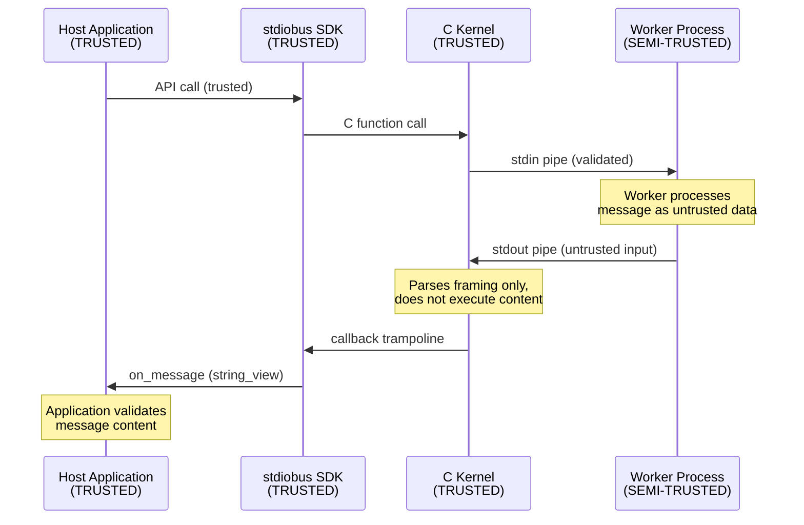

# Security

## Threat Model

stdiobus manages child processes and routes messages between a host application and worker processes. The trust boundaries are:



### Trust Assumptions

| Entity | Trust Level | Rationale |
|--------|-------------|-----------|
| Host application | Fully trusted | Controls SDK lifecycle |
| Configuration files | Trusted | Loaded at startup by host |
| Worker binaries | Trusted | Specified in config by host |
| Worker messages | Untrusted data | Parsed, validated, never executed |
| External clients (TCP/Unix) | Untrusted | Must be validated by application |

## Security Properties

### Memory Safety

- No raw pointer ownership in public API
- RAII for all resources (handles, processes)
- Bounded buffer sizes prevent memory exhaustion
- CI runs with AddressSanitizer and UndefinedBehaviorSanitizer

### Process Isolation

- Workers run as separate OS processes
- Communication is via stdin/stdout pipes only
- No shared memory between host and workers
- Worker crash does not crash the host

### Input Validation

- Message size is bounded by kernel configuration
- The SDK does not parse or execute message content
- Null pointer checks on all C API boundaries
- Invalid state transitions return errors (not UB)

### No Hidden Side Effects

- No network access from the SDK
- No file system writes (except Unix socket if configured)
- No environment variable reads without documentation
- No signal handler installation (user controls signals)
- No background threads (all I/O is explicit via `step()`)

## Hardening Recommendations

### Production Build

```bash
cmake -S . -B build \
    -DCMAKE_BUILD_TYPE=Release \
    -DCMAKE_CXX_FLAGS="-O2 -DNDEBUG -fstack-protector-strong -D_FORTIFY_SOURCE=2"
```

### Worker Configuration

- Use absolute paths for worker binaries
- Restrict worker permissions (drop privileges if possible)
- Set resource limits (memory, CPU) on worker processes via OS mechanisms
- Validate worker output before processing

### Network Modes (TCP/Unix)

- TCP mode binds to a local port — do not expose to untrusted networks without a proxy
- Unix socket mode uses filesystem permissions for access control
- Always validate client messages at the application level

## Vulnerability Reporting

See [SECURITY.md](../SECURITY.md) in the repository root.
